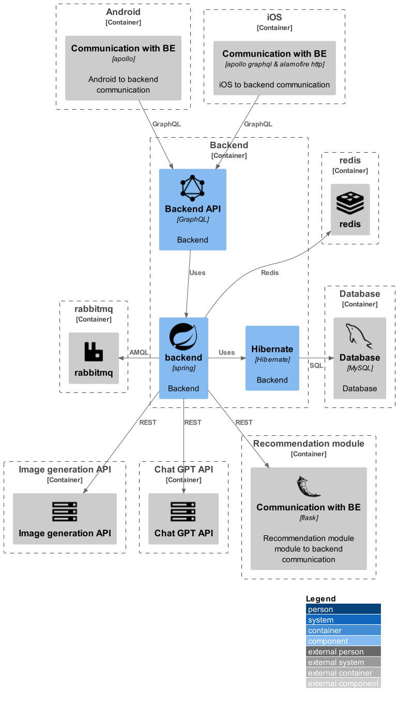

# Components

```plantuml
@startuml
!include https://raw.githubusercontent.com/plantuml-stdlib/C4-PlantUML/master/C4_Component.puml

!define DEVICONS2 https://raw.githubusercontent.com/tupadr3/plantuml-icon-font-sprites/master/devicons2
!define FONTAWESOME https://raw.githubusercontent.com/tupadr3/plantuml-icon-font-sprites/master/font-awesome-5
!define ICONURL https://raw.githubusercontent.com/tupadr3/plantuml-icon-font-sprites/v2.4.0
!include DEVICONS2/spring.puml
!include DEVICONS2/flask_original.puml
!include DEVICONS2/graphql.puml
!include DEVICONS2/mysql.puml
!include DEVICONS2/redis.puml
!include ../media/rabbitmq.puml
!includeurl ICONURL/font-awesome/server.puml

LAYOUT_WITH_LEGEND()

Container_Boundary(c1, Android) {
    Component_Ext(febecommunicationAndroid,"Communication with BE", "apollo", "Android to backend communication")
}
Container_Boundary(c2, iOS) {
    Component_Ext(febecommunicationiOS,"Communication with BE", "apollo graphql & alamofire http", "iOS to backend communication")
}
Container_Boundary(c3, Backend) {
    Component(be,"backend", "spring", "Backend", "spring")
    Component(beGraphQl,"Backend API", "GraphQL", "Backend", "graphql")
    Component(beHibernate,"Hibernate", "Hibernate", "Backend", "hibernate")
}
Container_Boundary(c5, Database) {
    Component_Ext(db,"Database", "MySQL", "Database", $sprite="mysql")
}
Container_Boundary(c6, "Image generation API") {
    Component_Ext(imageGenerationApi, "Image generation API", $sprite="server")
}
Container_Boundary(c7, Chat GPT API) {
    Component_Ext(chatGptApi, "Chat GPT API", $sprite="server")
}
Container_Boundary(c8, Recommendation module) {
    Component_Ext(recommentationModule,"Communication with BE", "flask", "Recommendation module module to backend communication", "flask_original")
}
Container_Boundary(c9, "redis") {
    Component_Ext(redis,"redis", $sprite="redis")
}
Container_Boundary(c10, "rabbitmq") {
    Component_Ext(rabbitmq,"rabbitmq", $sprite="rabbitmq")
}

Rel(febecommunicationAndroid, beGraphQl, "GraphQL")
Rel(febecommunicationiOS, beGraphQl, "GraphQL")

Rel_L(be, rabbitmq, "AMQL")

Rel_U(be, redis, "Redis")

Rel(beGraphQl, be, "Uses")

Rel_R(be, beHibernate, "Uses")
Rel_R(beHibernate, db, "SQL")

Rel(be, imageGenerationApi, "REST")
Rel(be, chatGptApi, "REST")

Rel(be, recommentationModule, "REST")

@enduml
```
