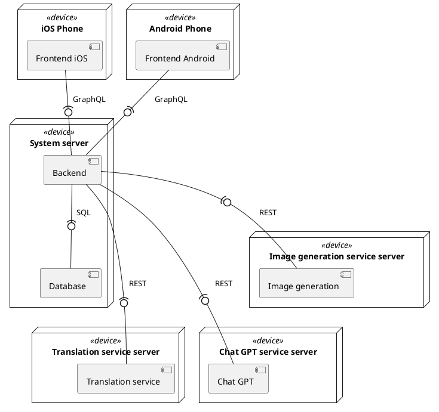

# Components diagram

```plantuml
@startuml
node "iOS Phone" <<device>> {
    component "Frontend iOS" as frontendIos
}
node "Android Phone" <<device>> {
    component "Frontend Android" as frontendAndroid
}
node "System server" <<device>> {
    component "Backend" as backend
    component "Database" as database
}
node "Translation service server" <<device>> {
    component "Translation service" as translator
}
node "Chat GPT service server" <<device>> {
    component "Chat GPT" as chatGpt
}
node "Image generation service server" <<device>> {
    component "Image generation" as imageGeneration
}

frontendAndroid -(0- backend: GraphQL
frontendIos -(0- backend: GraphQL

backend -(0- database :SQL
backend --(0- translator :REST
backend --(0- chatGpt: REST
backend -(0- imageGeneration: REST
@enduml
```
