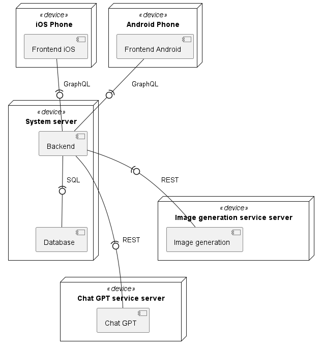

# Components diagram


# Containers diagram

```plantuml
@startuml
!include https://raw.githubusercontent.com/plantuml-stdlib/C4-PlantUML/master/C4_Container.puml

!define DEVICONS2 https://raw.githubusercontent.com/tupadr3/plantuml-icon-font-sprites/master/devicons2
!define FONTAWESOME https://raw.githubusercontent.com/tupadr3/plantuml-icon-font-sprites/master/font-awesome-5
!define ICONURL https://raw.githubusercontent.com/tupadr3/plantuml-icon-font-sprites/v2.4.0
!include DEVICONS2/spring.puml
!include DEVICONS2/mysql.puml
!include DEVICONS2/kotlin.puml
!include DEVICONS2/swift.puml
!include DEVICONS2/python.puml
!include FONTAWESOME/users.puml
!includeurl ICONURL/font-awesome/server.puml

LAYOUT_WITH_LEGEND()

Person(user, "Users", "System users", $sprite="users")

System_Boundary(c1, "Application") {
    Container(android, "Android", "android", "Android", $sprite="kotlin")
    Container(iOS, "iOS", "ios", "iOS", $sprite="swift")
    Container(backend, "Backend", "Java + Spring", "Business logic", $sprite="spring")
    ContainerDb(db, "Database", "SQL", "Data storing", $sprite="mysql")
}

Container_Ext(imageGenerationApi, "Image generation API", $sprite="server")
Container_Ext(chatGptApi, "Chat GPT API", $sprite="server")

Rel(user, android, "Uses", "https")
Rel(user, iOS, "Uses", "https")
Rel(android, backend, "API calls", "graphql")
Rel(iOS, backend, "API calls", "graphql")
Rel_R(db, backend, "Reads")
Rel(backend, db, "Writes")

Rel_U(backend, imageGenerationApi, "API calls", "REST")
Rel_L(backend, chatGptApi, "API calls", "REST")

@enduml
```

