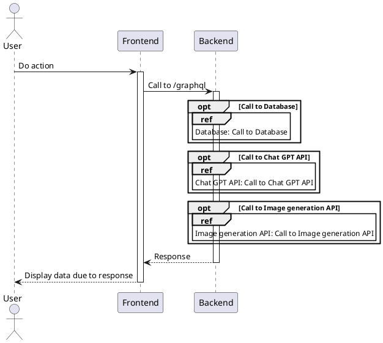
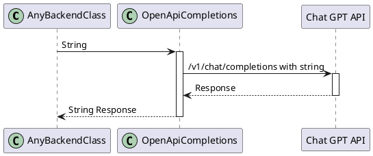
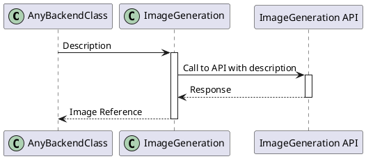
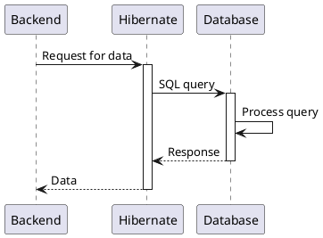

# Sequence diagrams
## Frontend calls backend

```plantuml
@startuml
actor User
participant Frontend
participant Backend

User -> Frontend: Do action
activate Frontend
Frontend -> Backend: Call to /graphql
activate Backend
opt Call to Database
    ref over Backend
        Database: Call to Database
    end
end
opt Call to Chat GPT API
    ref over Backend
        Chat GPT API: Call to Chat GPT API
    end
end
opt Call to Image generation API
    ref over Backend
        Image generation API: Call to Image generation API
    end
end
return Response
return Display data due to response
@enduml
```
## Backend calls Chat GPT API

```plantuml
@startuml
participant AnyBackendClass << (C,#ADD1B2) >>
participant OpenApiCompletions  << (C,#ADD1B2) >>
participant "Chat GPT API" as chatGpt

AnyBackendClass -> OpenApiCompletions: String
activate OpenApiCompletions
OpenApiCompletions -> chatGpt: /v1/chat/completions with string
activate chatGpt
return Response
return String Response
@enduml
```
## Backend calls Image generation API

```plantuml
@startuml
participant AnyBackendClass << (C,#ADD1B2) >>
participant ImageGeneration  << (C,#ADD1B2) >>
participant "ImageGeneration API" as imageGenerationApi

AnyBackendClass -> ImageGeneration: Description
activate ImageGeneration
ImageGeneration -> imageGenerationApi: Call to API with description
activate imageGenerationApi
return Response
return Image Reference
@enduml
```
## Backend calls Database

```plantuml
@startuml
participant Backend
participant Hibernate
participant Database

Backend -> Hibernate: Request for data
activate Hibernate
Hibernate -> Database: SQL query
activate Database
Database -> Database: Process query
return Response
return Data
@enduml
```