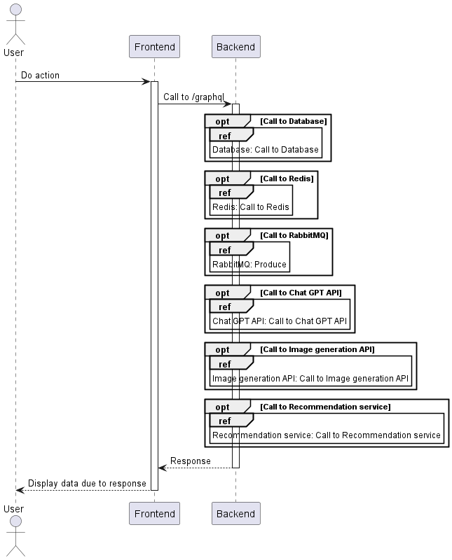
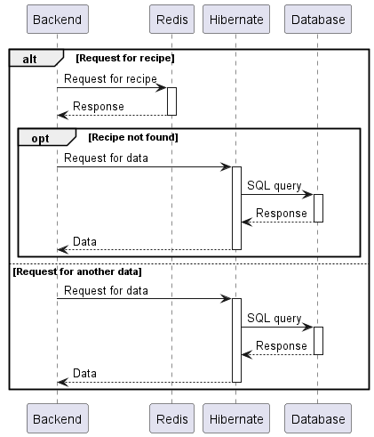

# Sequence diagrams
## Frontend calls backend

## Backend calls Chat GPT API

## Backend calls Image generation API

## Backend calls Database

## Backend calls Recommendation service
### Async request for recommendations

### Get recommendations

