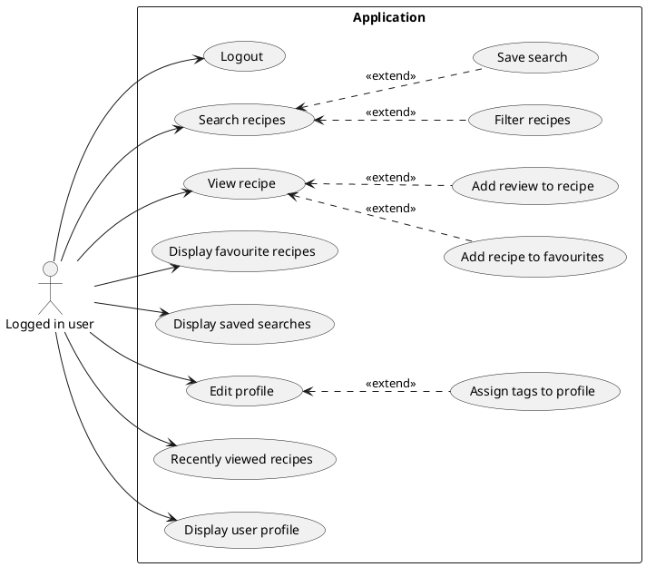

# System requirements

## Functional

- Every user can search recipe by attributes like:
    - Search phrase
    - Time of preparation (range)
    - Tags (searchable multiselect)
    - Nutrition
        - calories (range)
        - total fat (range)
        - sugar (range)
        - sodium (range)
        - protein (range)
        - saturated fat (range)
        - carbohydrates (range)
    - Number of steps (range)
    - Number of ingredients (multiselect)
    - Ingredients (multiselect)
    - Reviews (range)
- Search result will be paging
- Logged in user have extra features:
    - favourite recipes
    - saved searches
    - add recipe to favourites
    - edit profile
- Integrations:
    - Translator
    - Chat GPT – resume of your search parameters and results
    - Image generation - https://github.com/lucidrains/big-sleep or https://deepai.org/

## Non-functional

- Python or Database
    - for data set operations
- Java
    - call database/Python
    - searching and filtering
    - create API for frontend applications (GraphQL to communication)
    - external translation API calls
- Kotlin
    - Android Frontend Application
- Swift
    - iOS Frontend Application

## Use cases diagram

### Not logged in user

### Logged in user

