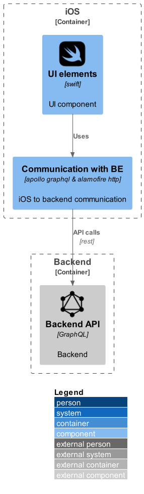

# Components
```plantuml
@startuml
!include https://raw.githubusercontent.com/plantuml-stdlib/C4-PlantUML/master/C4_Component.puml
!define DEVICONS2 https://raw.githubusercontent.com/tupadr3/plantuml-icon-font-sprites/master/devicons2
!define FONTAWESOME https://raw.githubusercontent.com/tupadr3/plantuml-icon-font-sprites/master/font-awesome-5
!include DEVICONS2/swift.puml
!include DEVICONS2/graphql.puml

LAYOUT_WITH_LEGEND()

Container_Boundary(c1, iOS) {
    Component(fe,"UI elements", "swift", "UI component", "swift")
    Component(febecommunication,"Communication with BE", "apollo graphql & alamofire http", "iOS to backend communication")
}
Container_Boundary(c2, Backend) {
    Component_Ext(be,"Backend API", "GraphQL", "Backend", "graphql")
}
Rel(fe, febecommunication, "Uses")
Rel(febecommunication, be, "API calls", "rest")

@enduml
```
